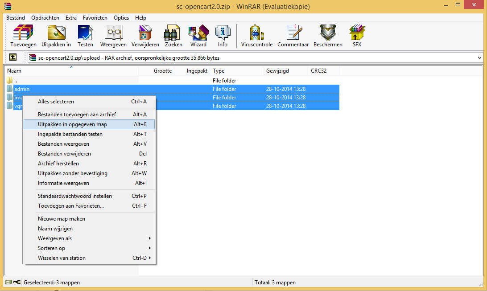
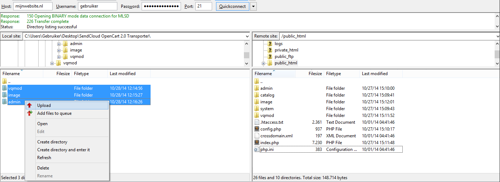
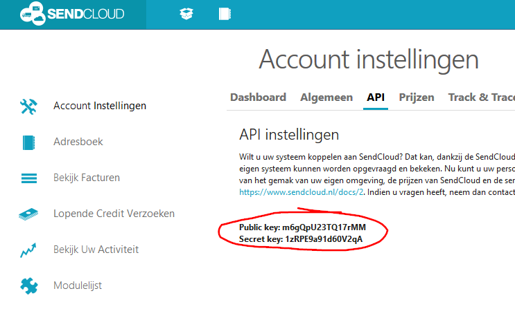
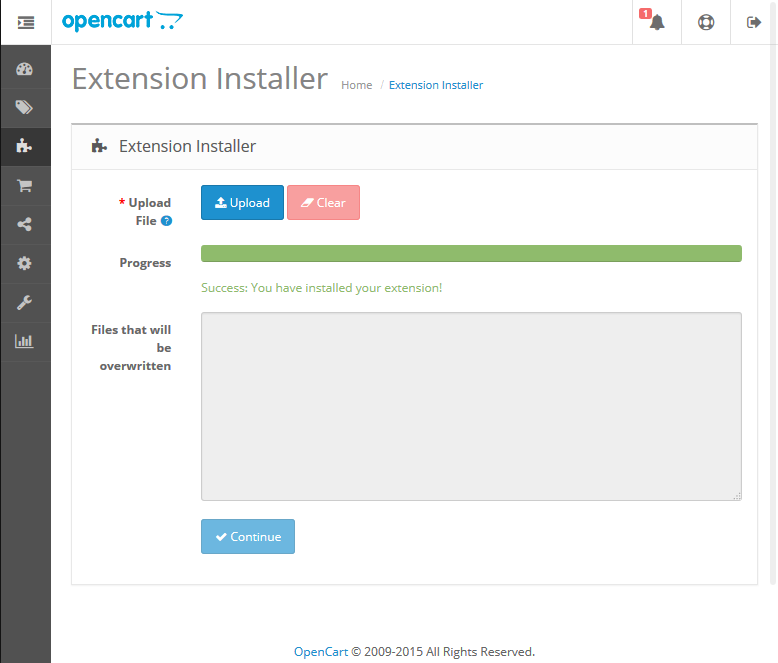
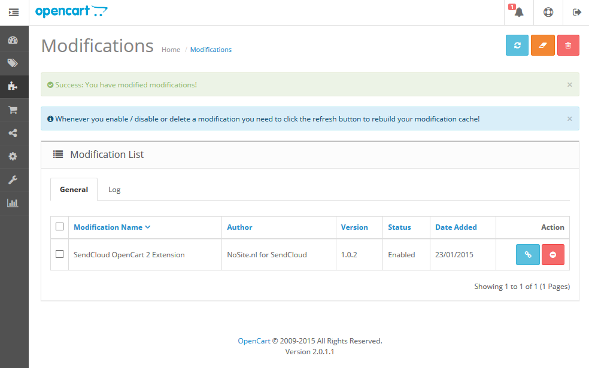

************
Installation
************

**Notice!** A SendCloud account is required to use this extension. You can request one for free `here <https://www.sendcloud.nl/aanmelden/?r=OpenCartDocs>`_.

1.  Download the SendCloud Extension
====================================
The easiest way to to get the module is to get it from the OpenCart extension store:

.. include:: ../../README.rst
	:start-after: Extension Store:
	:end-before: SendCloud

2.  Extract the SendCloud Extension
===================================
Extract the OpenCart extension to a location at your computer.

 
3.  Installing vQmod
====================
If you’ve already installed vQmod or if you prefer OCmod you can skip this step and go to :ref:`step 4 <step-four>`.

1. Download latest version of vQmod for OpenCart from GitHub.
	https://github.com/vqmod/vqmod/releases

2. The easiest way to install vQmod is with this instruction video.
	http://youtu.be/ezS1jWoMmjc

3. Or follow this guide on GitHub.
	https://github.com/vqmod/vqmod/wiki/Installing-vQmod-on-OpenCart

.. _step-four:

4.  Upload the SendCloud Extension
==================================
Connect to your website with your favorite FTP client. If you don’t have any you can use `FileZilla <https://filezilla-project.org/>`_.

Upload the files from the ``upload`` folder from the extension package to your website.

 
5.  Get SendCloud API keys
==========================
Login on the `SendCloud Panel <https://panel.sendcloud.nl>`_  with your SendCloud account.  Choose ``Settings (Instellingen) -> API``.

Copy your public and secret key. 

6. (optional) Upload the OCmod XML file
=======================================

If you don't use vQmod and if you want to use OCmod for the overrides in the OpenCart system you need upload the sendcloud.ocmod.xml file.
The file can be found in the folder in the folder `ocmod/` of this module. 

Upload the file `sendcloud.ocmod.xml` with help of the extension installer wizard of OpenCart and proceed with the next step. 

Don't forget to clear the cache to activate this file. This can be done by going to the modifications page. Select the SendCloud module modification and press the upper right blue and orange buttons to reload the module and clear the cache of the selected SendCloud module.

 
 
7.  Activate the SendCloud Extension
====================================
Login to the OpenCart admin area. Go to ``Extensions -> Modules`` and click on the green button from the SendCloud Extension.

 
The SendCloud Extension is activated.

8.  Setup the SendCloud Extension
=================================
Click on the blue edit button.

 
Insert your API public & secret key. Choose your order state and save the settings.