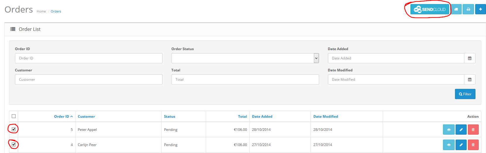

*****
Usage
*****

Transport orders to SendCloud
=============================
The extension is installed. You can now use the SendCloud Extension to transport your orders.
In the OpenCart admin go to ``Sales -> Orders``.

Select the orders you want to transport to SendCloud and click the button with the SendCloud logo.

 

Error messages
==============

One or more orders have no shipping details. Check the order information if there is shipping information available. 
Be aware that payment information is not the same as shipping information.

 
Check the SendCloud Extension's settings. The public key and/or secret key may be blank. If both settings are not blank check if your API keys are correct in the
`SendCloud Panel <https://panel.sendcloud.nl/>`_.
 

The orders can’t be transported to SendCloud. This occurs when you don't have a suitable shipping method configured in your SendCloud account.
You should contact the `SendCloud support team <contact@sendcloud.nl>`_ if you think that you're not having access to the correct shipping methods. 