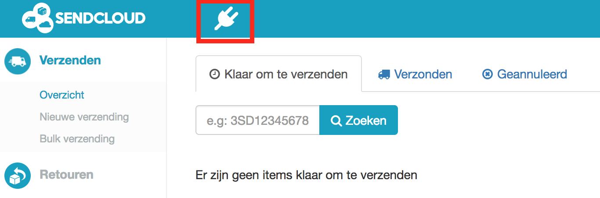
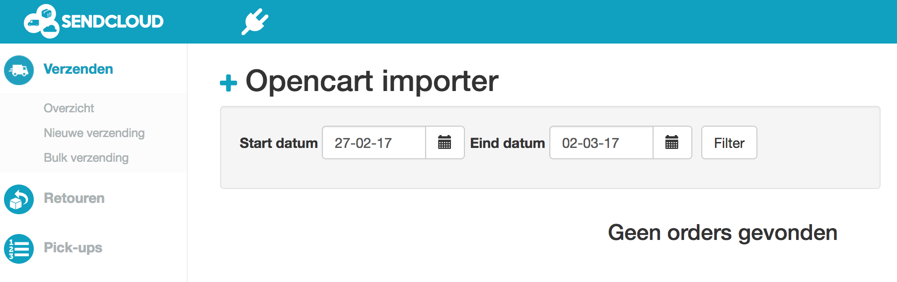
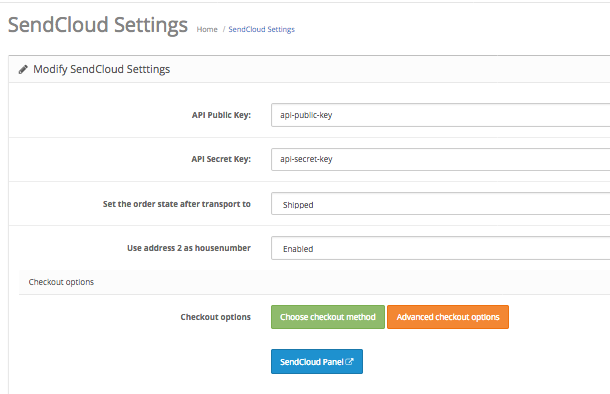
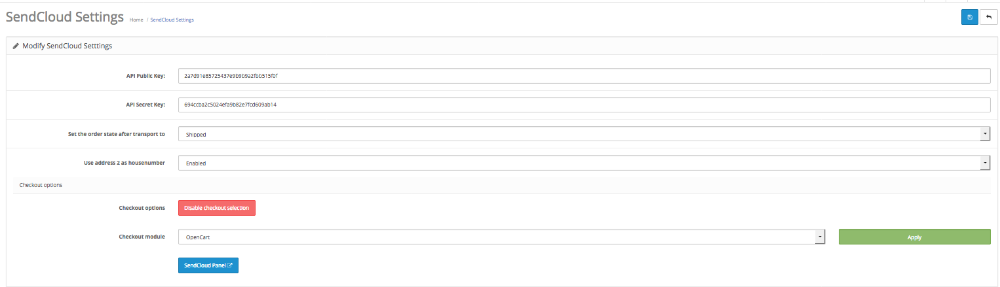

*******
Gebruik
*******

Orders transporteren naar SendCloud
===================================
Nu de extensie is geïnstalleerd kun je de orders naar SendCloud overzetten.
Ga naar je bestellingen in de OpenCart admin. ``Verkopen -> Orders``. 

Selecteer vervolgens de orders die je wilt overzetten en klik op de knop met het SendCloud logo. 

.. image:: ../images/extension_transport.png

Orders verwerken in SendCloud
=============================
Login in het `SendCloud Panel <https://panel.sendcloud.nl>`_  met uw SendCloud account.
In het blauwe top menu, selecteer het plug icoontje (als u meerdere integraties actief heeft, kunnen er meerdere icoontjes in deze balk staan, in dit geval kiest u het plug icoontje voor uw nieuw opgezette integratie).

Op de overzichtspagina die toont nadat u op het plug icoontje heeft geklikt, vindt u de orders die verstuurd zijn via de SendCloud module vanuit uw OpenCart webshop.

Afhaal locatiekiezer gebruiken
==============================
Om de afhaal locatiekiezer te gebruiken opent u de module in OpenCart en klikt u ``Choose checkout method / Kies een kassa module``. Er verschijnt vervolgens een dropdown waarin u uw kassamodule kunt kiezen.

Op dit moment is er support voor de standaard OpenCart module en de Journal Quickcheckout module, ondersteuning voor andere checkouts zal volgen.

Na het selecteren van uw gewenste kassamodule klikt u op de groene knop ``Apply`` om de instellingen uit te rollen, en vervolgens op de blauwe knop bovenaan om het geheel op te slaan.

Foutmeldingen
=============
.. image:: ../images/extension_error_shipping_details.png

Een of meerdere orders heeft geen verzendgegevens (shipping details). Ga naar het detailoverzicht van de order en kijk of de verzendgegevens zijn ingevuld.
Let erop dat betalings gegevens niet hetzelfde zijn als de verzendgegevens. 

.. image:: ../images/extension_error_api_keys.png
 
Er is iets mis met de koppeling met SendCloud. de public key en/of secret key zijn misschien niet goed ingevuld. Kijk na of de keys hetzelfde zijn als in het `SendCloud Panel <https://panel.sendcloud.nl/>`_.
 
.. image:: ../images/extension_error_process.png

De orders kunnen niet overgezet worden naar SendCloud. Dit gebeurt wanneer er geen geschikte verzendmethode beschikbaar is voor de order.
Je kunt contact opnemen met het `SendCloud support team <contact@sendcloud.nl>`_ om te kijken of het mogelijk is om een geschikte verzendmethode te activeren.